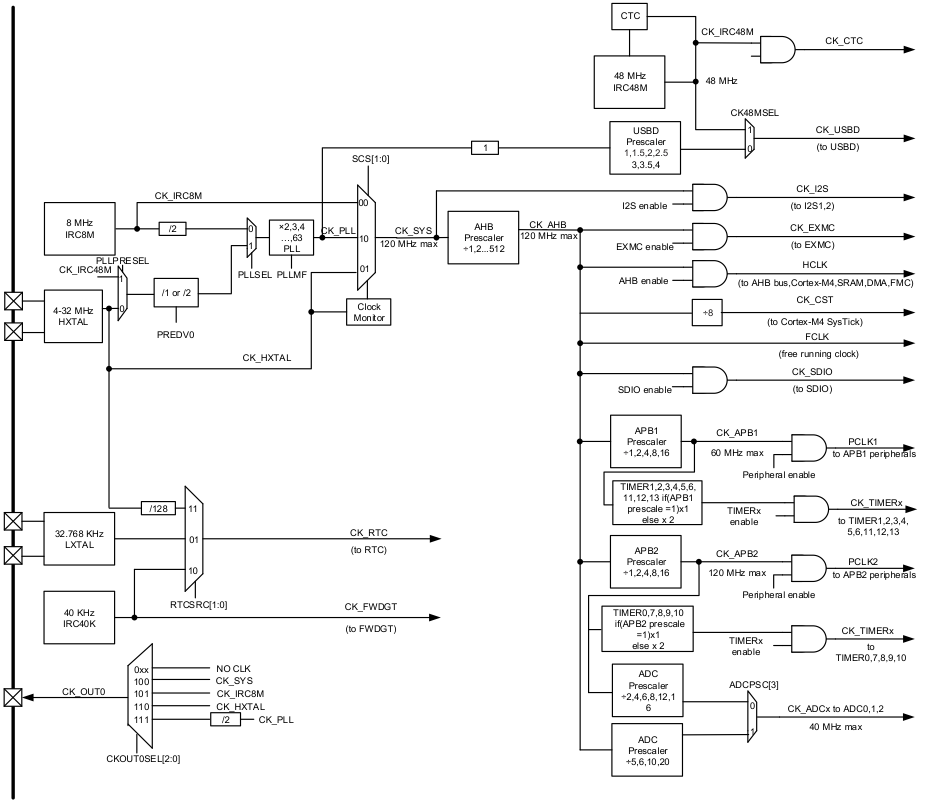

# RCU学习笔记

## Chapter 1 时钟

### 1.1 名词解释

- PLL:
  > PLL(Phase Locked Loop)： 为锁相回路或锁相环，用来统一整合时钟信号，使高频器件正常工作，如内存的存取资料等。PLL用于振荡器中的反馈技术。 许多电子设备要正常工作，通常需要外部的输入信号与内部的振荡信号同步。一般的晶振由于工艺与成本原因，做不到很高的频率，而在需要高频应用时，由相应的器件VCO，实现转成高频，但并不稳定，故利用锁相环路就可以实现稳定且高频的时钟信号。(摘自百度百科)

  > 锁相环路是一种反馈控制电路，简称锁相环（PLL,Phase-Locked Loop）。锁相环的特点是：利用外部输入的参考信号控制环路内部振荡信号的频率和相位。因锁相环可以实现输出信号频率对输入信号频率的自动跟踪，所以锁相环通常用于闭环跟踪电路。锁相环在工作的过程中，当输出信号的频率与输入信号的频率相等时，输出电压与输入电压保持固定的相位差值，即输出电压与输入电压的相位被锁住，这就是锁相环名称的由来。(摘自百度百科)

- AHB:
  > AHB总线规范是AMBA总线规范的一部分，AMBA总线规范是ARM公司提出的总线规范，被大多数SoC设计采用，它规定了AHB (Advanced High-performance Bus)、ASB (Advanced System Bus)、APB (Advanced Peripheral Bus)。AHB用于高性能、高时钟频率的系统结构，典型的应用如ARM核与系统内部的高速RAM、NAND FLASH、DMA、Bridge的连接。APB用于连接外部设备，对性能要求不高，而考虑低功耗问题。ASB是AHB的一种替代方案。
  (摘自CSDN博客，链接：<https://blog.csdn.net/ivy_reny/article/details/78144785>)

### 1.2 时钟树

### 1.3 时钟树分析笔记

- 时钟源可以选择内部8MHz时钟源(**IRC8M**)，外部4~32MHz高速时钟源(**HXTAL**)以及内部48MHz高速时钟源(**IRC48M**)，并且可以经过PLL进行倍频。
- CK_SYS（即系统时钟）配置方法有三种，当SCS寄存器配置为00时，CK_SYS为8MHz（内部8MHz直连）；当SCS寄存器配置为01时，CK_SYS为外部高速时钟源的频率，即与外部高速时钟直连；当SCS寄存器配置为10时，CK_SYS为时钟源经过PLL倍频获得的频率值。

## Chapter 2 时钟配置

### 2.1 时钟源配置

    void rcu_system_clock_source_config(uint32_t ck_sys);

- 参数 ck_sys：
  
  | 值             | 意义                     | 官方解释                                    |
  | -------------- | ------------------------ | ------------------------------------------- |
  | RCU_SCSS_IRC8M | 时钟源配置为内部8M时钟   | CK_IRC8M is selected as the CK_SYS source   |
  | RCU_SCSS_HXTAL | 时钟源配置为外部高速晶振 | CK_IRC8M is selected as the CK_HXTAL source |
  | RCU_SCSS_PLL   | 时钟源配置PLL            | CK_PLL is selected as the CK_SYS source     |

### 2.2 AHB、APB1、APB2、PLL配置

    void rcu_ahb_clock_config(uint32_t ck_ahb);

    void rcu_apb1_clock_config(uint32_t ck_apb1);

    void rcu_apb2_clock_config(uint32_t ck_apb2);

    void rcu_pll_config(uint32_t pll_src, uint32_t pll_mul);
